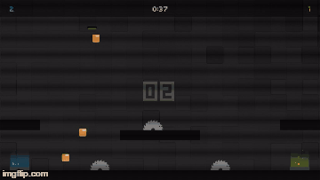
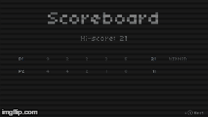
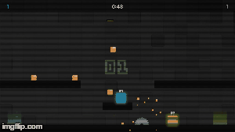

## About
CleanerBots by Tokelo Maifo

This game was adapted from a game I made for [pyweek 20](https://pyweek.org/)
Collect more data orbs than your opponent to win.

## Development
Python 2.7,

Pygame Latest,

Pytmx Latest

ConfigObj

## Controls
A, LEFT --  Move Left,

D, RIGHT -- Move Right,

Y, SHIFT  -- JUMP,

G, Ctrl -- Throw

ESC -- PAUSE

## Preview
Play it on [itch.io](http://phyrebotcentral.itch.io/cleanerbots).

## Screenshots
  

## License
Licensed under the [MIT License](License.txt)

Kenpixel fonts - www.kenney.nl
sfx sounds - www.kenney.nl

PyTMX by Bitcraft licensed under LGPL v3

## Website
www.phyrebotcentral.com